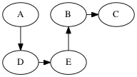
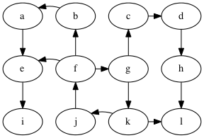
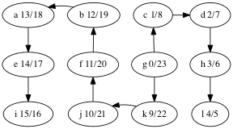
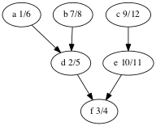
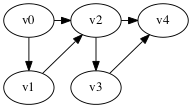
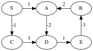
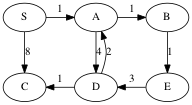
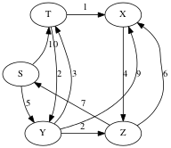

# Depth-First Search continued

From last time, example DFS:


Solutions (there are multiple depth-first trees)





There are two ways to implement DFS. The first is like the algorithm
for BFS, but replaces the queue with a stack.

    while not stack.empty()
	  u = stack.pop()
	  for v in G.adjacent(u)
	    if not visited[v]
		  visited[v] = true
		  parent[v] = u
		  stack.push(v)

The second algorithm for DFS is recursive:

    DFS(u, G, parent, visited) =
	  for v in G.adjacent(u)
	    if not visited[v]
	      visited[v] = true
		  parent[v] = u
		  DFS(v, G, parent, visited)
		
## Edge Categories

In the following we'll use this example graph:



We can categorizes the edges of the graph with respect to the depth-first 
tree in the following way:
- tree edge: an edge on the tree, e.g., g → c in the graph above.
- back edge: an edge that connects a descendent to an ancestor
  with respect to the tree, e.g., f → g.
- forward edge: an edge that connects an ancestor to a descendent
  wrt. the tree, e.g., f → e
- cross edge: all other edges, e.g., k → l.

A graph has a cycle if and only if there is a back edge.

The DFS algorithm can compute the categories if we use a color
scheme to mark the vertices instead of just using a `done` flag.
The colors are:
- white: the vertex has not been discovered
- gray: the vertex has been discovered but some of its descendents
  have not yet been discovered
- black: the vertex and all of its descendents have been discovered

During DFS, when considering an out-edge of the current vertex, the edge
can be categorized as follows:
- the target vertex is white: this is a tree edge
- the target vertex is gray: this is a back edge
- the target vertex is black: this could either be a forward or cross edge

Do the DFS example again but with the white/gray/black colors.

## Discover and Finish Times

We can discover yet more structure of the graph if we record
timestamps on a vertex when it is discovered (turned from white to
gray) and when it is finished (turned from gray to black).

This is useful when constructing other algorithms that use DFS,
such as topological sort. Here are the discover/finish times
for the DFS tree we computed above, shown again below.



What's the relationship between topological ordering and depth-first
search?

Let's look at the depth-first forest and discover/finish
times of the makefile graph.



Here's the vertices ordered by finish time:
f,d,a,b,e,c.

That's the reverse of one of the topological orders:
c,e,b,a,d,f.

Why is that? A vertex is finished *after* every vertex that depends
on it is finished. That's the same as topological ordering
except we've swapped *before* for *after*.

# Lecture: Shortest Paths

We have seen the shortest path problem where each edge counts as
distance 1 and we used BFS to solve it. Now we consider graphs where
each edge has a real number for its *weight*.

Notation: We write w(u,v) or w(e) for the *weight* of an edge.

**Definition** The *weight of a path* is the sum of the weights of its
edges.  We also use the term *distance* for the weight of a path.
  
So for path p = e₁, e₂, ..., eᵣ

    w(p) = Σ{i∈1..r} w(eᵢ)

Motivation for the shortest path problem:
- internet packet routing
- driving routes
- minimizing flight duration

As with BFS, we'll focus on the single-source shortest-paths problem:
finding the shortest path from a source vertex to every other vertex
in the graph. Other alternatives are:
  
- Single-destination shortest-paths
- Single-pair shortest-path
- All-pairs shortest-paths

## Algorithm Preview

- Bellman-Ford: O(nm)
- Disjktra: 
	* using min-heap: O((n+m) log(n))
	* using Fibonnaci heap: O(n log(n) + m)
- DAG Shortest: O(n+m)      (uses topological sort)

Brute force: compute the length of every path

But this is exponential time: there are O(2^n) paths.
Here's a worst-case scenario.




## Shortest paths exhibit *optimal substructure*

That is, a subpath of a shortest path is a shortest path.

More precisely, if you have a shortest path

v₀ →ᵣ vᵢ →p vⱼ →q vk

then the subpath p

vᵢ →p vⱼ

is a shortest path from vᵢ to vⱼ.

Proof. Suppose vᵢ →p vⱼ is not a shortest path from vᵢ to vⱼ.
Then we splice the shortest path p' from vᵢ to vⱼ into
the path v₀ → vk to get

    v₀ →ᵣ vᵢ →p' vⱼ →q vk

which is a shorter path from v₀ to vk.
But that contradicts the assumption that

    v₀ →ᵣ vᵢ →p vⱼ →q vk

was a shortest path.

Take away: we can build shortest paths by growing them from smaller
shortest paths.

Notation: d(u,v) is the weight of the shortest path from u to v.

##  Negative-weight edges

Motivation: weak, not very common
    
Some shortest-path algorithms handle this (Bellman-ford), some do not
(Dijkstra, DAG Shortest Paths).
      
None of them handle graphs with negative-weight cycles, as the notion
of shortest-path doesn't make sense on such graphs.
        
Example:
        


The shortest path from S to C is -1.

The shortest path from S to A is undefined because you can keep going
around the cycle A → D → E → B, which has weight -2.
      
We can avoid negative weights in some situations by shifting weights up.


## Triangle Inequality

For all edges u → v, d(s,v) ≤ d(s,u) + w(u,v).

Proof: s → u → v is a path from s to v, and d(s,v) is the weight of
the shortest path.


## Relaxation

We maintain a current best path length, an upper bound, on the
distance to a vertex.

We *relax an edge* by updating the distance of the target vertex if
this edge provides a shorter path to it.

```
static void relax(Edge e, double[] distance, int[] parent,
                  Map<Edge,Double> weight) {
    if (distance[e.target] > distance[e.source] + weight.get(e)) {
	    distance[e.target] = distance[e.source] + weight.get(e);
		parent[e.target] = e.source;
	}
}
```

## Dijkstra Shortest Paths

Like BFS, the idea is to expand the wavefront of shortest-paths so far.

The challenge is to figure out how to explore paths in the order of
their weight. Consider the following graph with the source vertex S.



Growing the shortest paths tree in order of path weight:

            W=0   S

            W=1   S-->A


            W=2   S-->A-->B


            W=3   S-->A-->B
                          |
                          V
                          E

            W=5   S-->A-->B
                      |   |
                      V   V
                      D   E

            W=6   S-->A-->B
                      |   |
                      V   V
                  C<--D   E

Dijkstra's solution is to store all the potential next vertices (those
that are adjacent to the tree) in a priority queue ordered by their
distance as computed by the current tree plus the weight of the
lightest edge to that vertex.  Then the minimum of the priority queue
gives the next shortest path.

                   SPT                  Priority Queue
            W=0    S                    A:1, C:8

            W=1    S---A                B:2, D:5, C:8

            W=2    S---A---B            E:3, D:5, C:8

            W=3    S---A---B            D:5, C:8
                           |
                           |
                           E

            W=5    S---A---B            C:6  (decrease key!)
                       |   |
                       |   |
                       D   E

            W=6    S---A---B
                       |   |
                       |   |
                   C---D   E

**Student group work**: use Dijkstra's to compute the distances from S
to all the other vertices in the following graph.



        Answers:
    
               S: 0
               T: 8
               X: 9
               Y: 5
               Z: 7


Time Complexity of Dijkstra's Algorithm

 * n pushes to the queue: O(n log(n))
 * n pops from the queue: O(n log(n))
 * m `decrease_key` on the queue: O(m log(n))
 * Total: O((n+m) log(n))
